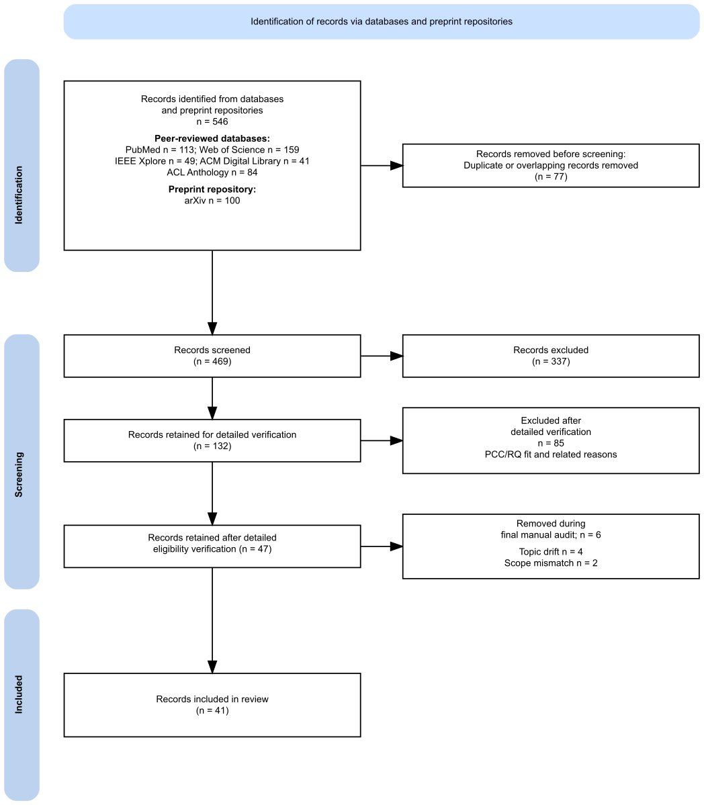

# Awesome Medical Agent Evaluation
[](https://doi.org/10.5281/zenodo.21341662)

A curated evidence map of medical AI agents powered by large language models, vision-language models, and multimodal foundation models, with a focus on evaluation methods, safety oversight, governance controls, and clinical translation readiness.

This repository is designed as a public, GitHub-friendly companion resource for a scoping review of medical AI agents. It provides structured metadata, DOI/URL links, and study-level coding. It does **not** redistribute full-text PDFs or copyrighted article content.

## Scope

Included records describe medical, health-care, public-health, biomedical, educational, administrative, or health-system AI-agent systems with at least one reported agentic property, such as planning, tool use, retrieval, memory, iterative control, workflow interaction, simulation interaction, or multi-agent collaboration.

Unlike broad AI-in-medicine repositories, this project focuses specifically on **agentic medical AI systems** and charts each study by evaluation design, safety oversight, governance reporting, and evidence maturity.

## Dataset

The main table is available at [`data/included_studies.csv`](data/included_studies.csv).

The public table includes only DOI/URL links and structured coding fields:

- study ID, title, year, venue
- system name, medical context, function
- agentic features and evaluation setting
- safety oversight reporting level
- evidence maturity level and evidence gap
- DOI and URL

Current included records: **41**.

## Included Studies

The complete included-record table is listed below for quick browsing and sorted by publication year from newest to oldest. The machine-readable version with additional structured fields is available at [`data/included_studies.csv`](data/included_studies.csv).

| Study | Year | Evaluation | Safety | Evidence | DOI/URL | Code |
|---|---:|---|---|---|---|---|
| Development of a generative AI agent for family support in implementing family-based treatment for children and adolescents with anorexia nervosa | 2026 | Benchmark or simulation evaluation | 4 - Evaluated | Level 2 | [10.3389/fdgth.2026.1759690](https://doi.org/10.3389/fdgth.2026.1759690) |  |
| Transforming oncology clinical trial matching through neuro-symbolic, multi-agent AI and an oncology-specific knowledge graph: a prospective evaluation in 3804 patients | 2026 | Prospective silent-mode or workflow study | 4 - Evaluated | Level 4 | [10.1016/j.esmorw.2026.100706](https://doi.org/10.1016/j.esmorw.2026.100706) |  |
| A randomized controlled trial of a WeChat-based artificial intelligence agent for postoperative care in orthopedic patients | 2026 | Clinical evaluation or monitored real-world use | 4 - Evaluated | Level 5 | [10.1038/s41746-025-02269-8](https://doi.org/10.1038/s41746-025-02269-8) |  |
| Explainable and evidence-linked recommendations for spine surgery via a retrieval-augmented LLM agent | 2026 | Retrospective clinical-data evaluation | 4 - Evaluated | Level 3 | [10.1016/j.ejrad.2026.112734](https://doi.org/10.1016/j.ejrad.2026.112734) |  |
| Performance comparison of a neuro-symbolic large language model system versus conventional AI models and human experts in cholangitis management | 2026 | Benchmark or simulation evaluation | 1 - Conceptually mentioned | Level 2 | [10.1186/s12911-026-03593-z](https://doi.org/10.1186/s12911-026-03593-z) |  |
| MedAgentBench v2: Improving Medical LLM Agent Design | 2026 | Benchmark or simulation evaluation | 2 - Included in design | Level 2 | [10.1142/9789819824755_0025](https://doi.org/10.1142/9789819824755_0025) | [Code](https://github.com/ericoericochen/medagentbenchv2) |
| Large Language Model Agent for Managing Patients With Suspected Hypertension | 2026 | Retrospective clinical-data evaluation | 2 - Included in design | Level 3 | [10.1161/hypertensionaha.125.25305](https://doi.org/10.1161/hypertensionaha.125.25305) |  |
| Agentic LLM for anonymizing healthcare data with contextual awareness | 2026 | Retrospective clinical-data evaluation | 4 - Evaluated | Level 3 | [10.1016/j.knosys.2026.116034](https://doi.org/10.1016/j.knosys.2026.116034) |  |
| Impact of patient communication style on agentic AI-generated clinical advice in E-medicine | 2026 | Retrospective clinical-data evaluation | 4 - Evaluated | Level 3 | [10.1016/j.amjmed.2025.12.027](https://doi.org/10.1016/j.amjmed.2025.12.027) |  |
| EvoMDT: a self-evolving multi-agent system for structured clinical decision-making in multi-cancer | 2026 | Retrospective clinical-data evaluation | 4 - Evaluated | Level 3 | [10.1038/s41746-025-02304-8](https://doi.org/10.1038/s41746-025-02304-8) |  |
| AgentClinic: a multimodal benchmark for tool-using clinical AI agents | 2026 | Benchmark or simulation evaluation | 2 - Included in design | Level 2 | [10.1038/s41746-026-02674-7](https://doi.org/10.1038/s41746-026-02674-7) | [Code](https://github.com/samuelschmidgall/agentclinic) |
| Artificial intelligence agent for delirium screening among patients in oncology and cardiac intensive care units: a proof-of-concept study | 2026 | Retrospective clinical-data evaluation | 4 - Evaluated | Level 3 | [10.1093/eurjcn/zvag029](https://doi.org/10.1093/eurjcn/zvag029) |  |
| AutoMedic: An Automated Evaluation Framework for Clinical Conversational Agents with Medical Dataset Grounding | 2026 | Benchmark or simulation evaluation | 2 - Included in design | Level 2 | [10.1109/jbhi.2026.3703097](https://doi.org/10.1109/jbhi.2026.3703097) |  |
| A multiagent large language model-based system to simulate the liver transplant selection committee: a retrospective cohort study | 2026 | Retrospective clinical-data evaluation | 2 - Included in design | Level 3 | [10.1016/j.landig.2025.100966](https://doi.org/10.1016/j.landig.2025.100966) |  |
| Let large language models judge each other: multi-agent peer-reviewed reasoning for medical question answering | 2026 | Benchmark or simulation evaluation | 2 - Included in design | Level 2 | [10.48550/arxiv.2606.15419](https://doi.org/10.48550/arxiv.2606.15419) |  |
| EC2Seq2Sql: Patient-trial matching with LLM agents | 2026 | Retrospective clinical-data evaluation | 2 - Included in design | Level 3 | [10.1371/journal.pone.0341827](https://doi.org/10.1371/journal.pone.0341827) |  |
| Addressing hallucinations in generative AI agents using observability and dual memory knowledge graphs | 2026 | Benchmark or simulation evaluation | 4 - Evaluated | Level 2 | [10.1016/j.knosys.2026.115469](https://doi.org/10.1016/j.knosys.2026.115469) |  |
| MedCTA: A Benchmark for Clinical Tool Agents | 2026 | Benchmark or simulation evaluation | 4 - Evaluated | Level 2 | [10.48550/arxiv.2606.11702](https://doi.org/10.48550/arxiv.2606.11702) | [Code](https://github.com/IVUL-KAUST/MedCTA) |
| PhysicianBench: Evaluating LLM Agents in Real-World EHR Environments | 2026 | Retrospective clinical-data evaluation | 2 - Included in design | Level 3 | [10.48550/arxiv.2605.02240](https://doi.org/10.48550/arxiv.2605.02240) | [Code](https://github.com/HealthRex/PhysicianBench) |
| DoctorAgent-RL: A Multi-Agent Collaborative Reinforcement Learning System for Multi-Turn Clinical Dialogue | 2026 | Benchmark or simulation evaluation | 2 - Included in design | Level 2 | [10.48550/arxiv.2505.19630](https://doi.org/10.48550/arxiv.2505.19630) | [Code](https://github.com/JarvisUSTC/DoctorAgent-RL) |
| Infherno: End-to-end Agent-based FHIR Resource Synthesis from Free-form Clinical Notes | 2026 | Retrospective clinical-data evaluation | 2 - Included in design | Level 3 | [10.48550/arxiv.2507.12261](https://doi.org/10.48550/arxiv.2507.12261) | [Code](https://github.com/j-frei/Infherno) |
| ART: Action-based Reasoning Task Benchmarking for Medical AI Agents | 2026 | Retrospective clinical-data evaluation | 2 - Included in design | Level 3 | [10.48550/arxiv.2601.08988](https://doi.org/10.48550/arxiv.2601.08988) |  |
| AgentRx: A Benchmark Study of LLM Agents for Multimodal Clinical Prediction Tasks | 2026 | Retrospective clinical-data evaluation | 2 - Included in design | Level 3 | [10.48550/arxiv.2605.10286](https://doi.org/10.48550/arxiv.2605.10286) |  |
| Towards autonomous medical artificial intelligence agents | 2026 | Retrospective clinical-data evaluation | 4 - Evaluated | Level 3 | [10.1038/s41586-026-10675-5](https://doi.org/10.1038/s41586-026-10675-5) | [Code](https://github.com/Dyke-F/MIRA) |
| Physician-Reported Safety Outcomes of AI-Generated Hospital Course Summaries | 2026 | Clinical evaluation or monitored real-world use | 5 - Deployed/monitored | Level 5 | [10.1001/jamanetworkopen.2026.16556](https://doi.org/10.1001/jamanetworkopen.2026.16556) | [Code](https://github.com/fcgrolleau/medfacteval) |
| A Bilingual On-Premises AI Agent for Clinical Drafting: Implementation Report of Seamless Electronic Health Records Integration in the Y-KNOT Project | 2025 | Prospective silent-mode or workflow study | 3 - Implemented | Level 4 | [10.2196/76848](https://doi.org/10.2196/76848) |  |
| CARE-AD: a multi-agent large language model framework for Alzheimer’s disease prediction using longitudinal clinical notes | 2025 | Retrospective clinical-data evaluation | 1 - Conceptually mentioned | Level 3 | [10.1038/s41746-025-01940-4](https://doi.org/10.1038/s41746-025-01940-4) |  |
| ADAM-1: An AI Reasoning and Bioinformatics Model for Alzheimer’s Disease Detection and Microbiome-Clinical Data Integration | 2025 | Retrospective clinical-data evaluation | 2 - Included in design | Level 3 | [10.1109/access.2025.3599857](https://doi.org/10.1109/access.2025.3599857) |  |
| An Agentic LLM-Based Framework for Population-Scale Mental Health Screening | 2025 | Benchmark or simulation evaluation | 2 - Included in design | Level 2 | [10.48550/arxiv.2605.13046](https://doi.org/10.48550/arxiv.2605.13046) |  |
| PathFinder: A Multi-Modal Multi-Agent System for Medical Diagnostic Decision-Making Applied to Histopathology | 2025 | Retrospective clinical-data evaluation | 4 - Evaluated | Level 3 | [10.48550/arxiv.2502.08916](https://doi.org/10.48550/arxiv.2502.08916) |  |
| Large language model agents can use tools to perform clinical calculations | 2025 | Benchmark or simulation evaluation | 4 - Evaluated | Level 2 | [10.1038/s41746-025-01475-8](https://doi.org/10.1038/s41746-025-01475-8) | [Code](https://github.com/stanfordaimlab/llm-as-clinical-calculator) |
| Development and validation of an autonomous artificial intelligence agent for clinical decision-making in oncology | 2025 | Benchmark or simulation evaluation | 4 - Evaluated | Level 2 | [10.1038/s43018-025-00991-6](https://doi.org/10.1038/s43018-025-00991-6) |  |
| MRAgent: an LLM-based automated agent for causal knowledge discovery in disease via Mendelian randomization | 2025 | Benchmark or simulation evaluation | 2 - Included in design | Level 2 | [10.1093/bib/bbaf140](https://doi.org/10.1093/bib/bbaf140) | [Code](https://github.com/xuwei1997/MRAgent) |
| An Adaptive Multi-Agent LLM-Based Clinical Decision Support System Integrating Biomedical RAG and Web Intelligence | 2025 | Benchmark or simulation evaluation | 2 - Included in design | Level 2 | [10.1109/access.2025.3613340](https://doi.org/10.1109/access.2025.3613340) |  |
| AI Hospital: Benchmarking Large Language Models in a Multi-agent Medical Interaction Simulator | 2025 | Benchmark or simulation evaluation | 2 - Included in design | Level 2 | [URL](https://aclanthology.org/2025.coling-main.680/) | [Code](https://github.com/LibertFan/AI_Hospital) |
| MeNTi: Bridging Medical Calculator and LLM Agent with Nested Tool Calling | 2025 | Benchmark or simulation evaluation | 4 - Evaluated | Level 2 | [10.18653/v1/2025.naacl-long.263](https://doi.org/10.18653/v1/2025.naacl-long.263) | [Code](https://github.com/shzyk/MENTI) |
| CP-Env: Evaluating Large Language Models on Clinical Pathways in a Controllable Hospital Environment | 2025 | Benchmark or simulation evaluation | 2 - Included in design | Level 2 | [10.48550/arxiv.2512.10206](https://doi.org/10.48550/arxiv.2512.10206) |  |
| Lessons Learned from Evaluation of LLM based Multi-agents in Safer Therapy Recommendation | 2025 | Benchmark or simulation evaluation | 4 - Evaluated | Level 2 | [10.48550/arxiv.2507.10911](https://doi.org/10.48550/arxiv.2507.10911) |  |
| Multi-Planners in Plan-and-Solve Prompting for Medical Reasoning | 2025 | Benchmark or simulation evaluation | 1 - Conceptually mentioned | Level 2 | [10.1109/bigdata66926.2025.11402280](https://doi.org/10.1109/bigdata66926.2025.11402280) |  |
| Evaluating large language models as agents in the clinic. | 2024 | Conceptual proposal or non-implemented framework | 1 - Conceptually mentioned | Level 0 | [10.1038/s41746-024-01083-y](https://doi.org/10.1038/s41746-024-01083-y) |  |
| TriageAgent: Towards Better Multi-Agents Collaborations for Large Language Model-Based Clinical Triage | 2024 | Benchmark or simulation evaluation | 2 - Included in design | Level 2 | [10.18653/v1/2024.findings-emnlp.329](https://doi.org/10.18653/v1/2024.findings-emnlp.329) | [Code](https://github.com/Lucanyc/TriageAgent) |

## Related Reviews

Related reviews of medical AI agents, agentic AI in healthcare, biomedical agents, and domain-specific medical-agent systems. These contextual sources are not part of the 41 records included in the scoping review. A machine-readable version is available at [`data/related_reviews.csv`](data/related_reviews.csv).

| Study                                                                                                                                                                               | Year | DOI/URL                                                                                |
| ----------------------------------------------------------------------------------------------------------------------------------------------------------------------------------- | ---: | -------------------------------------------------------------------------------------- |
| Alhazba SA, Ali MH, Alawi DA, et al. From Reactive AI to Agentic Systems: A Review of Autonomous medical AI Agents in Healthcare.                                                   | 2026 | [10.1007/s11831-026-10655-y](https://doi.org/10.1007/s11831-026-10655-y)               |
| Branda F, Ahmed MM, Ciccozzi M, et al. The next paradigm in bioinformatics: a review of multi-agent systems and foundational models for end-to-end scientific discovery.            | 2026 | [10.1093/bib/bbag245](https://doi.org/10.1093/bib/bbag245)                             |
| Chen LF, Xu XM, Qin YM, et al. Vision-language foundation model driven agentic AI systems for healthcare.                                                                           | 2026 | [10.1007/s00371-026-04437-7](https://doi.org/10.1007/s00371-026-04437-7)               |
| Chen XL, Chen RY, Xu PS, et al. From visual question answering to intelligent AI agents in ophthalmology.                                                                           | 2026 | [10.1136/bjo-2024-326097](https://doi.org/10.1136/bjo-2024-326097)                     |
| Chen Y, Qin XQ, Chen SP. Foundation Models and AI Agents in Digital Pathology Imaging: A Systematic Review of Integration into the Clinical Workflow and Implementation Challenges. | 2026 | [10.1007/s10278-026-02034-7](https://doi.org/10.1007/s10278-026-02034-7)               |
| Dip SA, Mallick D, Shuvo UA, et al. Large language model agents for biological intelligence across genomics, proteomics, spatial biology, and biomedicine.                          | 2026 | [10.1093/bib/bbag110](https://doi.org/10.1093/bib/bbag110)                             |
| Ghanwatkar Y, Rajdeo P, Mahato RI. Foundation models and AI agents in oncology drug discovery.                                                                                      | 2026 | [10.1016/j.drudis.2026.104655](https://doi.org/10.1016/j.drudis.2026.104655)           |
| Guo XT, Chen J, Zhang YY, et al. Precision oncology: from large language models to multi-agent systems.                                                                             | 2026 | [10.3389/fonc.2026.1828507](https://doi.org/10.3389/fonc.2026.1828507)                 |
| Huynh DL, Seal S, Reid D, et al. AI agents in drug discovery: applications and case studies.                                                                                        | 2026 | [10.1016/j.drudis.2026.104650](https://doi.org/10.1016/j.drudis.2026.104650)           |
| Ma AR, Chen JY, Yang ZY. From Tool to Agent: A Semi-Systematic Review of Human-AI Alignment and a Proposed Tiered Healing Ecosystem for Mental Health.                              | 2026 | [10.3390/healthcare14060820](https://doi.org/10.3390/healthcare14060820)               |
| Qi C, Wang WB, Jiang SQ, et al. Artificial Intelligence agents for biological research: a survey.                                                                                   | 2026 | [10.1093/bib/bbag075](https://doi.org/10.1093/bib/bbag075)                             |
| Salehi S, Keishing V, Singh Y, et al. Systematic Review: Agentic AI in Neuroradiology: Technical Promise with Limited Clinical Evidence.                                            | 2026 | [10.1007/s10278-025-01839-2](https://doi.org/10.1007/s10278-025-01839-2)               |
| Silveira AL, Righi RR, da Costa CA. Multi-agent systems for clinical decision support: A systematic review.                                                                         | 2026 | [10.1016/j.asoc.2025.114447](https://doi.org/10.1016/j.asoc.2025.114447)               |
| Soetikno BT, Nielsen CS, Pollreisz A, et al. Toward autonomous discovery: agentic AI and the future of ophthalmic research.                                                         | 2026 | [10.1097/ICU.0000000000001179](https://doi.org/10.1097/ICU.0000000000001179)           |
| Srinivasu P, Aruna Kumari GL, Ahmed S, et al. Exploring agentic AI in healthcare: a study on its working mechanism.                                                                 | 2026 | [10.3389/fmed.2025.1753443](https://doi.org/10.3389/fmed.2025.1753443)                 |
| Tzanis E, Adams LC, D'Antonoli TA, et al. Agentic systems in radiology: Principles, opportunities, privacy risks, regulation, and sustainability concerns.                          | 2026 | [10.1016/j.diii.2025.10.002](https://doi.org/10.1016/j.diii.2025.10.002)               |
| Vatsal S, Dubey H, Singh A. Agentic AI in Healthcare and Medicine: A Seven-Dimensional Taxonomy for Empirical Evaluation of LLM-Based Agents.                                       | 2026 | [10.1109/access.2026.3651218](https://doi.org/10.1109/access.2026.3651218)             |
| Venerito V, Lopalco G, Iannone F, et al. Agentic AI in rheumatology.                                                                                                                | 2026 | [10.1016/S2665-9913(26)00076-7](<https://doi.org/10.1016/S2665-9913(26)00076-7>)       |
| Xu G, Li X, Chen Y, et al. A comprehensive survey of AI agents in healthcare.                                                                                                       | 2026 | [10.1016/j.jbi.2026.105045](https://doi.org/10.1016/j.jbi.2026.105045)                 |
| Zhao L, Liu S, Xin T, et al. AI agent in healthcare: applications, evaluations, and future directions.                                                                              | 2026 | [10.1038/s44387-026-00076-4](https://doi.org/10.1038/s44387-026-00076-4)               |
| Salehi S, Singh Y, Horst KK, et al. Agentic AI and Large Language Models in Radiology: Opportunities and Hallucination Challenges.                                                  | 2025 | [10.3390/bioengineering12121303](https://doi.org/10.3390/bioengineering12121303)       |
| Wang W, Ma Z, Wang Z, et al. A survey of LLM-based agents in medicine: how far are we from Baymax?                                                                                  | 2025 | [10.18653/v1/2025.findings-acl.539](https://doi.org/10.18653/v1/2025.findings-acl.539) |
| Xu X, Sankar R. Large language model agents for biomedicine: a comprehensive review of methods, evaluations, challenges, and future directions.                                     | 2025 | [10.3390/info16100894](https://doi.org/10.3390/info16100894)                           |
| Yang TT, Xiao YH, Bao ZJ, et al. The rise and potential opportunities of large language model agents in bioinformatics and biomedicine.                                             | 2025 | [10.1093/bib/bbaf601](https://doi.org/10.1093/bib/bbaf601)                             |

## Evidence Maturity Scale

| Level | Maturity category | Typical reported evidence source |
|---|---|---|
| Level 0 | Conceptual proposal or non-implemented framework | Commentaries, design blueprints, protocols, or frameworks without an implemented agentic workflow or empirical system run. |
| Level 1 | Implemented proof-of-concept without systematic evaluation | Implemented prototypes, demos, case examples, or feasibility checks without systematic benchmark, simulation, or clinical-data evaluation. |
| Level 2 | Benchmark or simulation evaluation | Public medical or biomedical benchmarks, retrieval or tool-use benchmarks, virtual patients, simulated EHR environments, diagnostic simulators, multi-agent clinical simulations, or red-teaming tasks. |
| Level 3 | Retrospective clinical-data evaluation | Historical EHRs, clinical notes, imaging archives, laboratory data, registries, claims data, de-identified patient messages, or retrospective patient cohorts. |
| Level 4 | Prospective silent-mode or workflow study | Silent-mode deployment, shadow testing, prospective usability studies, clinician-in-the-loop workflow evaluations, or workflow-integrated evaluations in real clinical settings without autonomous or interventional clinical action. |
| Level 5 | Clinical evaluation or monitored real-world use | Randomized or pragmatic clinical trials involving real patients, prospective clinical deployment, health-system implementation with active clinical use, or monitored clinical use of the complete agentic workflow. |

Full definitions are in [`data/evidence_maturity_levels.csv`](data/evidence_maturity_levels.csv).

## Safety Oversight Reporting Scale

| Code | Reporting status       |
| ---- | ---------------------- |
| 0    | Not reported           |
| 1    | Conceptually mentioned |
| 2    | Included in design     |
| 3    | Implemented            |
| 4    | Evaluated              |
| 5    | Deployed/monitored     |

Full definitions are in [`data/safety_oversight_reporting_scale.csv`](data/safety_oversight_reporting_scale.csv).

## Current Evidence Map

### Evidence maturity distribution

| Evidence maturity | Records |
| ----------------- | ------: |
| Level 0           |       1 |
| Level 2           |      20 |
| Level 3           |      16 |
| Level 4           |       2 |
| Level 5           |       2 |

### Safety oversight reporting distribution

| Safety reporting level     | Records |
| -------------------------- | ------: |
| 1 - Conceptually mentioned |       4 |
| 2 - Included in design     |      19 |
| 3 - Implemented            |       1 |
| 4 - Evaluated              |      16 |
| 5 - Deployed/monitored     |       1 |

## PRISMA Flow

The PRISMA-style flow diagram was generated with the [`prisma-flowdiagram/PRISMA2020`](https://github.com/prisma-flowdiagram/PRISMA2020) R package.



Counts are available in [`data/prisma_flow_counts.csv`](data/prisma_flow_counts.csv), and the reproducible R script is available in [`scripts/generate_prisma.R`](scripts/generate_prisma.R).

To regenerate the PNG, PDF, and SVG assets from the repository root:

```r
install.packages(c("remotes", "DiagrammeRsvg", "rsvg"))
remotes::install_github("prisma-flowdiagram/PRISMA2020")
```

```bash
Rscript scripts/generate_prisma.R
```

The script resolves paths relative to its own location and writes the three publication assets to `figures/`. The PNG is generated at 1048 x 1199 pixels.

## Repository Policy

This repository stores bibliographic links, DOI/URL metadata, and original coding produced by the review team. It does not host article PDFs, copyrighted full text, or long verbatim excerpts.

## Citation

If you use this resource, please cite the associated scoping review and this repository. Citation metadata for version 1.0.0 are provided in [`CITATION.cff`](CITATION.cff). The manuscript has been submitted; its DOI and the public repository URL will be added when available.
